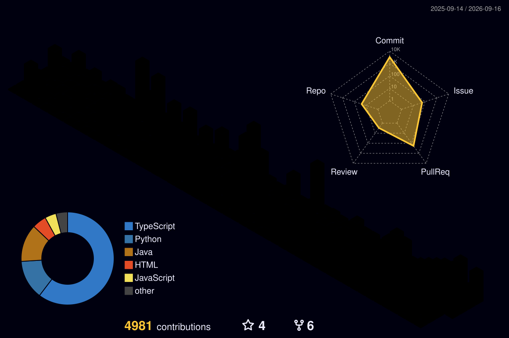

<div align="center">

<!-- Modern Art Dynamic Cyber-Sunset Header -->


<!-- Kinetic Typography & Digital Art Stream -->
<p align="center">
  <a href="https://github.com/Hesara2003">
    
  </a>
</p>

<!-- Geometric Bauhaus Navigation Badges -->
<p align="center">
  <a href="https://www.hesaraperera.com/">
    
  </a>
  &nbsp;
  <a href="https://www.linkedin.com/in/hesaraperera/">
    
  </a>
  &nbsp;
  <a href="mailto:hesarap3@gmail.com">
    
  </a>
  &nbsp;
  <a href="https://github.com/ieeecsopen">
    
  </a>
</p>

</div>

---

### 🎨 The Manifesto

> *"Code is not merely instructions for machines—it is structured thought, digital architecture, and kinetic sculpture. Every system should be robust by necessity and beautiful by design."*

```rust
// The Architect's Blueprint
struct Architect<'life> {
    identity:   &'life str,
    domain:     &'life str,
    canvas:     [&'life str; 3],
    current:    &'life str,
}

const HESARA: Architect = Architect {
    identity:   "Hesara Perera 🇱🇰",
    domain:     "Systems & Full-Stack Engineering",
    canvas:     ["High-Performance Runtimes", "Cloud Microservices", "Compilers & Security"],
    current:    "Chairperson @ IEEE Computer Society SLIIT (BSc CS, CGPA: 3.61)",
};
```

---

### 🏛️ The Exhibition (Featured Works)

<table width="100%">
  <tr>
    <td width="50%" valign="top" style="border: 2px solid #00F0FF; padding: 16px; background: #0d1117;">
      <h3 align="left">🛡️ <a href="https://github.com/ieeecsopen/lockdown-browser">EXHIBIT I: THE FORTRESS</a></h3>
      <p><b>IEEE CS Lockdown Browser</b> — <i>Native Kiosk Assessment Client</i></p>
      <p>A hardened examination environment enforcing native OS kiosk mode, global CoreGraphics hotkey interception, real-time process blacklisting, and zero-leakage AI domain filtering.</p>
      <p>
        
        
        
        
      </p>
    </td>
    <td width="50%" valign="top" style="border: 2px solid #FF0055; padding: 16px; background: #0d1117;">
      <h3 align="left">⚡ <a href="https://algojudge.ieeesliit.com/">EXHIBIT II: THE ARBITER</a></h3>
      <p><b>AlgoJudge Platform</b> — <i>Competitive Execution Engine</i></p>
      <p>Distributed code execution engine designed for high-concurrency university hackathons, featuring sub-millisecond sandboxing, queue routing, and automated test verdicts.</p>
      <p>
        
        
        
        
      </p>
    </td>
  </tr>
  <tr>
    <td width="50%" valign="top" style="border: 2px solid #7928CA; padding: 16px; background: #0d1117;">
      <h3 align="left">🪐 <a href="#">EXHIBIT III: THE MATRIX</a></h3>
      <p><b>NebulaCode Cloud IDE</b> — <i>Collaborative Workspace</i></p>
      <p>Real-time collaborative developer platform built with CRDT-based multi-user state synchronization, Monaco engine embedding, and live containerized execution.</p>
      <p>
        
        
        
        
      </p>
    </td>
    <td width="50%" valign="top" style="border: 2px solid #FFE600; padding: 16px; background: #0d1117;">
      <h3 align="left">⚙️ <a href="#">EXHIBIT IV: THE FLOW</a></h3>
      <p><b>Qlanka Pro</b> — <i>Event-Driven Microservices</i></p>
      <p>Cloud-native queue dispatch architecture on Microsoft Azure for enterprise customer scheduling, SMS alerting, multi-desk routing, and real-time telemetry.</p>
      <p>
        
        
        
        
      </p>
    </td>
  </tr>
</table>

---

### 🎨 Medium & Spectrum (Tech Stack)

<div align="center">

<p><b>Primary Mediums & Syntaxes</b></p>
<a href="https://skillicons.dev">
  
</a>

<br/><br/>

<p><b>Architectural & Framework Palette</b></p>
<a href="https://skillicons.dev">
  
</a>

<br/><br/>

<p><b>Infrastructure & Data Sculpting</b></p>
<a href="https://skillicons.dev">
  
</a>

</div>

---

### 🏙️ 3D Isometric Contribution Skyline

<div align="center">

<picture>
  <source media="(prefers-color-scheme: dark)" srcset="profile-3d-contrib/profile-night-rainbow.svg">
  <source media="(prefers-color-scheme: light)" srcset="profile-3d-contrib/profile-green-animate.svg">
  
</picture>

</div>

---

### 📊 Kinetic Telemetry (Live Activity & Streak)

<div align="center">


&nbsp;&nbsp;


<br/><br/>


</div>

---

### 🏆 Accolades & Curated Highlights

- 🥇 **1st Place Winner** — Most Innovative Architecture @ **INNOVELEC**
- 🎯 **Top 5 Finalist** — CodeRally 6.0 & SliitXtreme 3.0 Competitive Programming
- 🏅 **Volunteer of the Month** — IEEE Sri Lanka Section
- 🎓 **Dean's List Scholar** — SLIIT (Semester GPA: **3.94 / 4.00**)
- 📄 **Published Research** — IEEE IRC 2025 (*"Autonomous UAV Infrastructure in Precision Agriculture"*)
- 🪪 **Verified Certifications**:
  - AWS Certified Cloud Practitioner
  - Microsoft Professional UX Architecture
  - Stanford University Machine Learning
  - GitHub Advanced Security

---

### 🌐 The Studio / Let's Connect

<div align="center">

<p>Open for high-impact open-source initiatives, systems architecture consulting, and tech discussions.</p>

<a href="https://www.linkedin.com/in/hesaraperera/">
  
</a>
&nbsp;
<a href="https://www.hesaraperera.com/">
  
</a>
&nbsp;
<a href="mailto:hesarap3@gmail.com">
  
</a>

<br/><br/>

<!-- Modern Art Footer Wave -->


</div>
